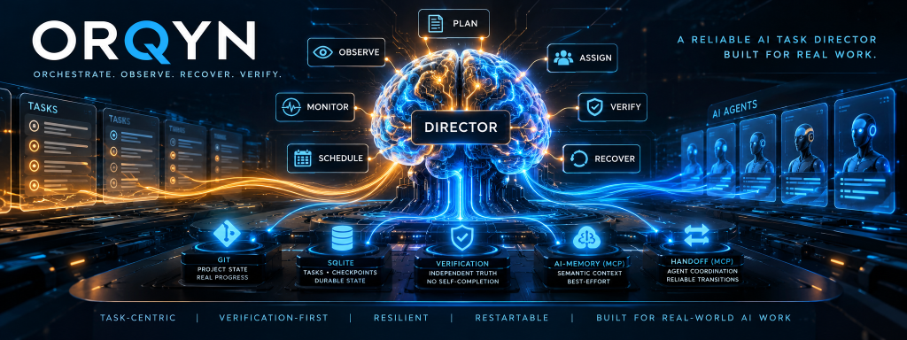
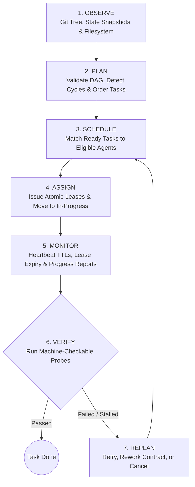

<div align="center">



# 🧠 Orqyn

[](https://www.rust-lang.org/)
[](LICENSE)
[](docs/PHASE0-FORENSICS.md)
[](tests/)
[](docs/)

**A vendor-independent orchestration brain for multi-agent software engineering.**

[Description](#project-description) • [Why Orqyn?](#why-orqyn) • [Core Invariants](#core-invariants) • [Control Loop](#the-control-loop) • [Architecture](#architecture) • [Crates](#crate-hierarchy) • [Quickstart](#quickstart) • [Roadmap](#roadmap) • [Documentation](#documentation)

</div>

---

## Project Description

**Orqyn** is an autonomous, vendor-agnostic orchestration brain built in pure Rust for coordinating multi-agent software engineering teams. 

Modern coding agents (such as Claude Code, OpenAI Codex, DeepSeek, Cursor, Goose, Devin, OpenCode, and Aider) are exceptional at local syntax generation, refactoring, and code comprehension. Concurrently, specialized tool servers like [handoff-mcp](https://github.com/alphaelements/handoff-mcp) and [ai-memory](https://github.com/akitaonrails/ai-memory) provide persistence backends for session logs and vector/FTS knowledge graphs.

However, existing multi-agent systems suffer from a critical architectural void: **no layer acts as an objective, supervisory brain.** 

Orqyn fills this gap. Sitting **above** the coding agents and **beside** memory/task substrates, Orqyn acts as an authoritative control engine that:
1. **Decomposes and validates objectives** into mathematically verified Directed Acyclic Graphs (DAGs).
2. **Dispatches work via time-limited, heartbeat-monitored leases** using an intelligent multi-agent matchmaker.
3. **Reclaims stranded work automatically** when an agent crashes, hangs, or disappears.
4. **Independently verifies completed work** using isolated, machine-checked test probes—completely eliminating hallucinated "I am done" declarations.
5. **Maintains append-only, transactional audit logs** backed by SQLite with optimistic concurrency versioning.
6. **Briefs replacement agents** with complete continuation packages containing project state, git diffs, prior verdicts, and dependency contracts.

```
                    ┌─────────────────────────────────────────────┐
                    │                   ORQYN                     │
                    │   Orchestration Brain & Control Engine      │
                    │   (Plan, Schedule, Assign, Verify, Recover) │
                    └───────────────┬────────────────────┬────────┘
                                    │                    │
                   MCP (stdio JSON) │                    │ MCP (stdio JSON)
                                    ▼                    ▼
               ┌───────────────────────┐      ┌──────────────────────────┐
               │      handoff-mcp      │      │        ai-memory         │
               │  Task/Session/Agent   │      │   Wiki + Long-Term Mem   │
               │  Substrate (.handoff) │      │   (SQLite + Markdown)    │
               └───────────┬───────────┘      └────────────┬─────────────┘
                           │                               │
                           └───────────────┬───────────────┘
                                           │ (Orqyn Drives Agents)
                                           ▼
                     ┌───────────────────────────────────────────┐
                     │              AGENT HARNESSES              │
                     │  Claude Code, Codex, DeepSeek, Cursor,    │
                     │  Goose, Devin, OpenCode, Aider, etc.      │
                     └─────────────────────┬─────────────────────┘
                                           │
                                           ▼
                                 GIT WORKING TREE / REPO
```

Orqyn communicates with all external substrates **exclusively over Model Context Protocol (MCP)** using line-delimited JSON-RPC 2.0 over `stdio`. It never links substrate source code, never imports substrate internal data structures, and enforces strict boundary isolation through automated CI tests.

---

## Why Orqyn?

### The 5 Failure Modes of Autonomous Multi-Agent Coding

| Failure Mode | Traditional Multi-Agent Setups | The Orqyn Solution |
|---|---|---|
| **1. Self-Reported Completion** | Agents mark tasks "Done" after generating code, even when unit tests fail or code does not compile. | **Objective Machine Probes**: `TaskStatus::Done` is unreachable by agent reports. Orqyn executes commands and test suites independently, reading exit codes directly. |
| **2. The Vanished Agent** | If an agent process crashes or loses its network connection, its assigned task is orphaned indefinitely. | **Heartbeat Lease Reclamation**: Assignments carry time-to-live leases. A silent agent loses its lease; the session is recorded as `vanished`, and the task returns to `todo`. |
| **3. Dependency Deadlocks** | Unchecked task lists result in circular blockers, missing prerequisite artifacts, or race conditions between parallel agents. | **Acyclic Graph (DAG) Engine**: Plans are validated for cycles, external references, and self-dependencies using Kahn's topological sort before atomic activation. |
| **4. Substrate Lock-in** | Orchestrators compile directly against specific memory or task libraries, creating rigid vendor lock-in. | **Zero Substrate Coupling**: Everything communicates across standard MCP JSON-RPC boundaries. Boundary tests fail the build if internal structs are imported. |
| **5. Destructive State Overwrites** | Task updates, decisions, and replans overwrite previous records in place, destroying historical audit trails. | **Append-Only SQLite History**: Plans supersede rather than delete. Decisions, verifications, and assignment histories accumulate durably with optimistic locking. |

---

## Core Invariants

Orqyn is architected around strict foundational invariants enforced in Rust's type system and database schemas:

### 1. Task Identity is Decoupled from Agent Identity
A task represents a unit of work that outlives any single agent assigned to it.
- `TaskId` and `AgentId` are sealed, distinct newtypes that cannot be coerced into one another.
- `Task` structs contain **no agent field**.
- Assignments are tracked via first-class `AgentAssignment` records. When an agent disconnects, crashes, or releases work, a new assignment record is created while the task’s identity and version history remain immutable.

### 2. Zero Self-Reported Completion (Machine-Checked Verification)
`TaskStatus::Done` is **unreachable** through an agent's self-report.
- An agent completing its work moves a task to `VerificationPending`, never `Done`.
- Only Orqyn's independent `VERIFY` engine can mark a task complete by executing machine-checkable probes (e.g. exit codes, test suites, deterministic diff checks) via its isolated `ExecutionProvider`.
- If an agent claims work is done but checks fail, the task transitions to `Failed` and triggers remediation in `REPLAN`.

### 3. Deterministic & Acyclic Graph Planning
Task dependencies form a strict Directed Acyclic Graph (DAG).
- The planner validates and rejects self-dependencies, references to external tasks, and cyclical dependency graphs.
- Tasks are ordered deterministically using Kahn’s topological sort with caller-order tie-breaking.
- Plan creation, task decomposition, and activation execute in a single atomic database transaction.

### 4. Lease-Based Scheduling with Automatic Stale Reclamation
Agent assignments operate under time-limited leases backed by active heartbeats.
- The `MONITOR` step inspects active leases against heartbeat timestamps.
- If an agent becomes silent past the lease TTL, Orqyn automatically expires the lease, marks the session as `vanished`, records the disconnect, and returns the task to `todo` for immediate reassignment.

### 5. Durable, Append-Only Storage & Optimistic Locking
State transitions and decisions are never overwritten destructively.
- Backed by an embedded SQLite engine with strict foreign keys and partial unique indexes (e.g., enforcing at most one active plan per project and at most one active assignment per task).
- Uses optimistic concurrency control (`state_version` lineage): concurrent stale writes fail fast and return structured conflict errors.
- Verifications, superseded plans, and rejected decisions accumulate as durable audit logs.

### 6. The Substrate Boundary is a Test, Not a Convention
Orqyn enforces architectural boundaries through automated regression tests:
- `crates/director-adapters/tests/boundary.rs` scans the entire workspace and fails the build if any crate outside `director-adapters` references substrate identifiers or crate dependencies.

---

## The Control Loop

Orqyn operates a continuous 6-step closed-loop lifecycle:



### Step Breakdown

| Step | Function | Responsibility |
|---|---|---|
| **OBSERVE** | `observe::observe_repository` | Scans the git working tree via `git2`, produces `ProjectStateSnapshot`, detects tree changes/renames/deletions, and syncs normalized state into Orqyn's store. |
| **PLAN** | `plan::plan_project` | Validates task specs against DAG rules (no cycles, no missing dependencies), computes topological sequence, and atomically activates the plan. |
| **SCHEDULE** | `schedule::schedule_round` | Pairs unassigned `ready_tasks` with available agents using a 4-tier policy: eligibility, fresh-eyes (prioritizing new agents), specialist-first (conserving generalists), and deterministic tie-breaking. |
| **ASSIGN** | `assign::assign_task` | Acquires a claim-once lease for an agent, transitions task status to `in_progress`, and records the assignment transactionally. |
| **MONITOR** | `monitor::monitor_project` | Checks heartbeat ages against TTL windows. Reclaims expired leases from vanished agents, handles progress reports, and moves finished work to `verification_pending`. |
| **VERIFY** | `engine::verify_task` | Resolves machine-checkable criteria into probes (`Probe::Command`), executes them via `ExecutionProvider`, reads raw exit codes, and writes append-only `Verification` records. |
| **REPLAN** | `replan::replan_project` | Evaluates failed or stranded tasks and applies caller-specified remediations (`Retry`, `Rework`, or `Cancel`) while reporting any dependent tasks left stranded. |
| **RECOVERY** | `recovery::brief_agent` | Assembles complete context snapshots (contracts, version history, previous verdicts, git checkpoints) to brief replacement agents seamlessly. |

---

## Architecture

```
                               ┌─────────────────────────────────────────┐
                               │             ORQYN CORE                  │
                               │                                         │
 ┌─────────────────────────┐   │   ┌─────────────────────────────────┐   │
 │   director-app          │───┼──>│  Control Loop Engine            │   │
 │   (Loop orchestration)  │   │   │  • observe   • schedule         │   │
 └─────────────────────────┘   │   │  • plan      • monitor          │   │
                               │   │  • assign    • verify / replan  │   │
 ┌─────────────────────────┐   │   └────────────────┬────────────────┘   │
 │   director-store        │───┼────────────────────┼────────────────┐   │
 │   (SQLite persistence)  │   │                    ▼                │   │
 └─────────────────────────┘   │   ┌─────────────────────────────────┐   │
                               │   │  director-domain                │   │
 ┌─────────────────────────┐   │   │  • Entities & 16 Newtype IDs    │   │
 │   director-adapters     │───┼──>│  • Acyclic Graph Topo-Sort      │   │
 │   (MCP & Execution)     │   │   │  • Provider Trait Definitions   │   │
 └─────────────────────────┘   │   └────────────────┬────────────────┘   │
                               └────────────────────┼────────────────────┘
                                                    │
                                  ┌─────────────────┴─────────────────┐
                                  ▼                                   ▼
                      ┌───────────────────────┐           ┌───────────────────────┐
                      │    HandoffAdapter     │           │    AiMemoryAdapter    │
                      │  (Task, Agent,        │           │  (Durable Memory &    │
                      │   Session Provider)   │           │   Graph Retrieval)    │
                      └───────────┬───────────┘           └───────────┬───────────┘
                                  │ JSON-RPC                          │ JSON-RPC
                                  ▼                                   ▼
                            handoff-mcp                           ai-memory
```

---

## Crate Hierarchy

The workspace is cleanly divided into four specialized crates:

```
orqyn/
├── crates/
│   ├── director-domain/       # Pure domain model: entities, state machines,
│   │                          # newtype IDs, graph algorithms, provider traits.
│   │                          # Zero external substrate dependencies.
│   │
│   ├── director-adapters/     # Hexagonal adapters implementing domain traits:
│   │                          # • InMemoryProvider (in-process mocks for all traits)
│   │                          # • LocalExecutor (process execution with timeouts)
│   │                          # • GitService / Observer (git2 read-only tree lens)
│   │                          # • HandoffAdapter (stdio JSON-RPC MCP to handoff-mcp)
│   │                          # • AiMemoryAdapter (stdio JSON-RPC MCP to ai-memory)
│   │
│   ├── director-store/        # Embedded SQLite store:
│   │                          # • Checkpoints, Plans, Tasks, Assignments, Verifications
│   │                          # • Optimistic concurrency versioning & partial unique indexes
│   │                          # • Embedded schema migrations (0001 - 0003)
│   │
│   └── director-app/          # Control loop orchestration:
│                              # • Modules: observe, plan, schedule, assign, monitor,
│                              #   verify, replan, engine, recovery
│
├── docs/                      # Architectural specifications and phase audit reports
├── Cargo.toml                 # Workspace configuration
└── THIRD_PARTY_LICENSES.md    # Upstream notices (MIT © 2026 Fabio Akita)
```

---

## Quickstart

### Prerequisites
- **Rust Toolchain**: `1.85+` (pinned in `rust-toolchain.toml` to `stable-x86_64-pc-windows-gnu` for Windows, or standard stable on Linux/macOS).
- **C Compiler & Linker**: GCC/Clang with standard build tools.
- **Git & SQLite3**.

### Installation & Build

```bash
# Clone the repository
git clone https://github.com/abyyxhek/orqynn.git
cd orqynn

# Build all workspace crates
cargo build

# Run the complete test suite (537+ tests)
cargo test --workspace
```

> **Windows OneDrive Tip**: If building inside a OneDrive directory, Windows file-locking can intermittently interrupt target builds. Redirect the build directory:
> ```powershell
> $env:CARGO_TARGET_DIR = "$HOME\.orqyn-target"
> cargo test --workspace
> ```

---

## Code Example: Using Orqyn as an Orchestrator

```rust
use std::sync::Arc;
use tempfile::tempdir;
use director_store::SqliteStore;
use director_adapters::memory::InMemoryProvider;
use director_adapters::execution::LocalExecutor;
use director_app::{
    plan::{plan_project, PlanSpec, TaskSpec},
    schedule::schedule_round,
    monitor::{monitor_project, ProgressReport},
    engine::verify_task,
};
use director_domain::{
    ids::{ProjectId, TaskId, AgentId},
    task::ExpectedOutput,
};

#[tokio::main]
async fn main() -> Result<(), Box<dyn std::error::Error>> {
    // 1. Initialize the SQLite store and providers
    let temp_dir = tempdir()?;
    let db_path = temp_dir.path().join("orqyn.db");
    let store = Arc::new(SqliteStore::open(&db_path).await?);
    let provider = Arc::new(InMemoryProvider::new());
    let executor = Arc::new(LocalExecutor::default());

    let project_id = ProjectId::from_string("PROJ-ALPHA");

    // 2. Define a multi-task plan with DAG dependencies
    let spec = PlanSpec {
        objective: "Implement and verify user authentication".into(),
        tasks: vec![
            TaskSpec {
                id: TaskId::from_string("TASK-MODEL"),
                title: "Define user authentication schemas".into(),
                description: "Create database models for auth".into(),
                dependencies: vec![],
                required_capabilities: vec![],
                expected_outputs: vec![
                    ExpectedOutput::machine_checkable("cargo check --bin auth"),
                ],
            },
            TaskSpec {
                id: TaskId::from_string("TASK-TESTS"),
                title: "Write authentication unit tests".into(),
                description: "Test login and token verification".into(),
                dependencies: vec![TaskId::from_string("TASK-MODEL")],
                required_capabilities: vec![],
                expected_outputs: vec![
                    ExpectedOutput::machine_checkable("cargo test --test auth_tests"),
                ],
            },
        ],
    };

    // 3. Validate DAG and activate plan atomically
    let plan = plan_project(&*store, &project_id, spec).await?;
    println!("Activated Plan: {} with {} tasks", plan.id, plan.tasks.len());

    // 4. Schedule ready tasks to available registered agents
    let schedule_result = schedule_round(&*store, &project_id).await?;
    println!("Scheduled {} assignment(s)", schedule_result.assigned.len());

    // 5. Simulate agent work and completion report
    let agent_id = AgentId::from_string("AGENT-CLAUDE");
    monitor_project(
        &*store,
        &project_id,
        &[ProgressReport::WorkComplete {
            task_id: TaskId::from_string("TASK-MODEL"),
            agent_id,
        }],
    ).await?;

    // 6. Independent Machine-Checked Verification
    let verdict = verify_task(
        &*store,
        &*executor,
        &TaskId::from_string("TASK-MODEL"),
        temp_dir.path(),
    ).await?;

    println!("Verification Verdict: {:?}", verdict.status);
    Ok(())
}
```

---

## Roadmap & Milestones

| Phase | Milestone | Description | Status |
|:---:|---|---|:---:|
| **0** | **Repository Forensics** | Deep architectural audit of `handoff-mcp` and `ai-memory`. Boundary and mapping analysis. | ✅ Complete |
| **1** | **Domain Modeling & Boundary** | Pure core domain types, sealed newtype IDs, state machines, provider traits. Zero coupling. | ✅ Complete |
| **2** | **Adapters & Observation** | `git2` observation layer + `HandoffAdapter` for `handoff-mcp` over stdio JSON-RPC. | ✅ Complete |
| **3** | **Memory Substrate** | `AiMemoryAdapter` over `ai-memory` for long-term vector/FTS5 retrieval and knowledge graphs. | ✅ Complete |
| **5** | **Durable Store** | `director-store` SQLite engine: optimistic version locking, checkpoints, verification logs. | ✅ Complete |
| **6** | **The Control Loop** | `director-app` engine: `OBSERVE`, `PLAN`, `ASSIGN`, `MONITOR`, `VERIFY`, `REPLAN`. | ✅ Complete |
| **7** | **Intelligent Scheduler** | Matchmaking policy: eligibility, fresh-eyes anti-bias, specialist-first, and deterministic tie-breaking. | ✅ Complete |
| **10** | **Verification Engine** | Machine-checkable probe runner (`Probe::Command`), exit-code analysis, append-only history. | ✅ Complete |
| **11** | **Runtime & Recovery Validation** | Integration test suite proving crash survival, rebase tolerance, and replacement agent briefings. | ✅ Complete |
| **12** | **Orqyn Native Daemon & MCP** | Standalone headless background daemon and Orqyn's native Model Context Protocol server. | 🔄 Planned |

---

## Documentation

Comprehensive design specifications and architectural reports are available in the [`docs/`](docs/) directory:

- [📄 PHASE0-FORENSICS.md](docs/PHASE0-FORENSICS.md) — Upstream substrate audit, tool surfaces, and boundary rules.
- [📄 PHASE1-DOMAIN.md](docs/PHASE1-DOMAIN.md) — Pure domain entity specifications and invariant rules.
- [📄 PHASE2-ADAPTERS.md](docs/PHASE2-ADAPTERS.md) — Stdio JSON-RPC client and `HandoffAdapter` mappings.
- [📄 PHASE2-OBSERVATION.md](docs/PHASE2-OBSERVATION.md) — Git working tree observer and change event system.
- [📄 PHASE3-MEMORY.md](docs/PHASE3-MEMORY.md) — `AiMemoryAdapter` client and long-term memory query protocol.
- [📄 PHASE5-STORE.md](docs/PHASE5-STORE.md) — SQLite schema design, partial unique indexes, and versioning.
- [📄 PHASE6-APP.md](docs/PHASE6-APP.md) — Complete 6-step control loop implementation guide.
- [📄 PHASE7-SCHEDULE.md](docs/PHASE7-SCHEDULE.md) — Matchmaker algorithms and agent allocation policies.
- [📄 PHASE10-ENGINE.md](docs/PHASE10-ENGINE.md) — Probe resolution, evidence gathering, and verification recording.
- [📄 PHASE11-RUNTIME-RECOVERY.md](docs/PHASE11-RUNTIME-RECOVERY.md) — Crash resilience and agent briefing recovery proofs.

---

## Attribution & License

Orqyn communicates with [handoff-mcp](https://github.com/alphaelements/handoff-mcp) and [ai-memory](https://github.com/akitaonrails/ai-memory) as separate processes across standard MCP boundaries. No code is copied from upstream repositories. Both substrates are MIT licensed (© 2026 Fabio Akita); their notices are reproduced in [`THIRD_PARTY_LICENSES.md`](THIRD_PARTY_LICENSES.md).

Orqyn is open-source software licensed under the [MIT License](LICENSE).
Published at [github.com/abyyxhek/orqynn](https://github.com/abyyxhek/orqynn).
